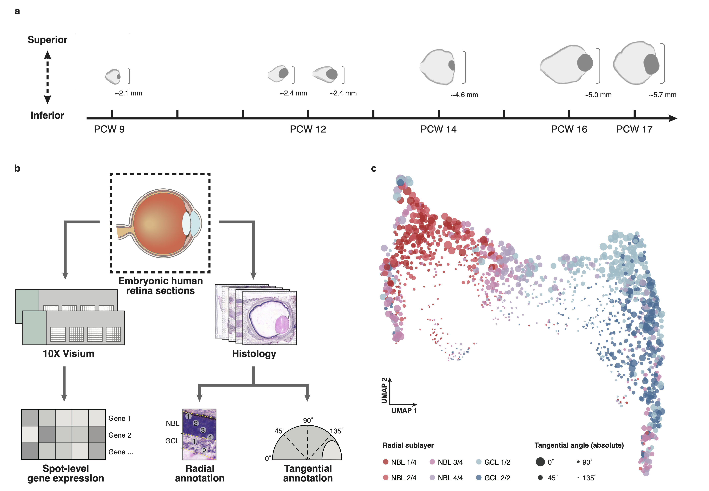

# Spatiotemporal transcriptome atlas of the developing human retina
Code and data related to our manuscript "Spatiotemporal transcriptome atlas of the developing human retina".

## Main software requirements
* R 4.3.1
* Seurat 4.3.0
* Cell2location 0.1.0
* OpenCV 4.9.0
* WGCNA 1.71
* clusterProfiler 4.10.0
* COMMOT 0.0.3
* CellPhoneDB 4.0.0
* SPARK 1.1.1

## Code
Code for analysis and visualization is avaiable as [Rscripts](Rscripts).

Anyone can reproduce results in the manuscript in order based on the file prefix.

## Data
* Raw data: the spatial transcriptome data generated in this study of the human embryonic retina has been deposited at the Genome Sequence Archive for Human (GSA-Human) under the accession number HRA006282.
* H&E staining: the staining images related to the raw data are avaiable at [Staining](Staining).

## Citation
Zhang *et al*. (2024) Spatiotemporal transcriptome atlas of the developing human retina.
