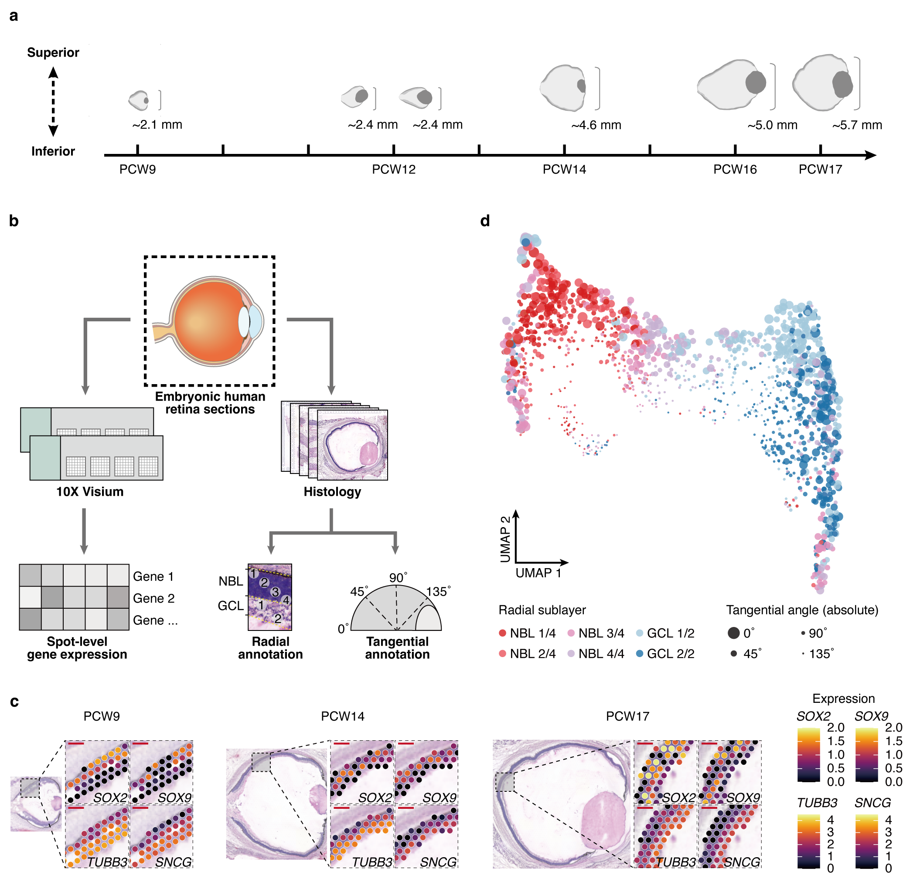

# Spatiotemporal transcriptome atlas of the developing human retina
Code and data related to our manuscript "Spatiotemporal transcriptome atlas of the developing human retina".

## Code
Code for analysis and visualization is avaiable as [Rscripts](Rscripts)

## Data
* Raw data: the spatial transcriptome data generated in this study of the human embryonic retina has been deposited at the Genome Sequence Archive for Human (GSA-Human) under the accession number HRA006282.
* H&E staining: the staining images related to the raw data are avaiable at [Staining](Staining)

## Citation
Zhang *et al*. (2023) Spatiotemporal transcriptome atlas of the developing human retina.
